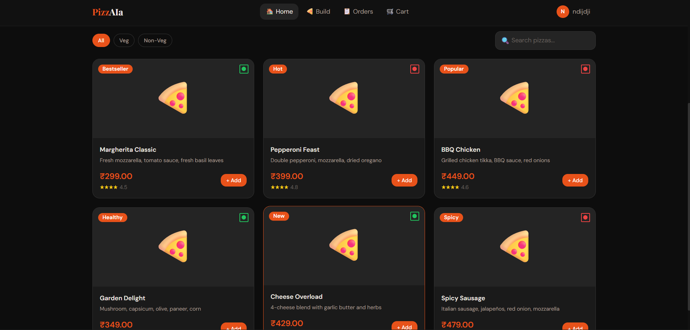
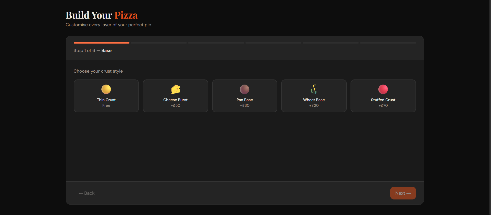
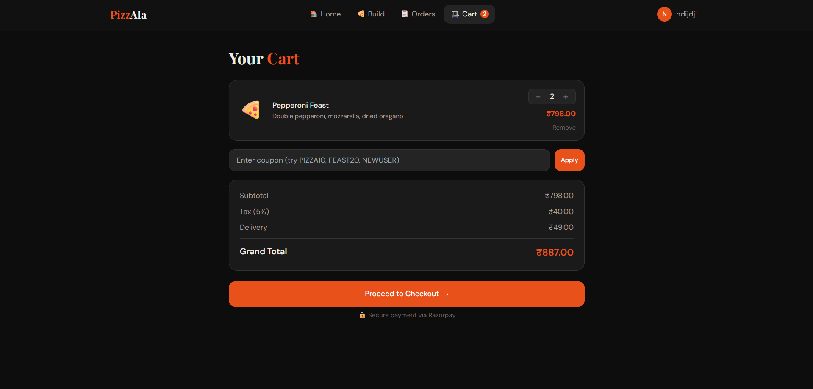
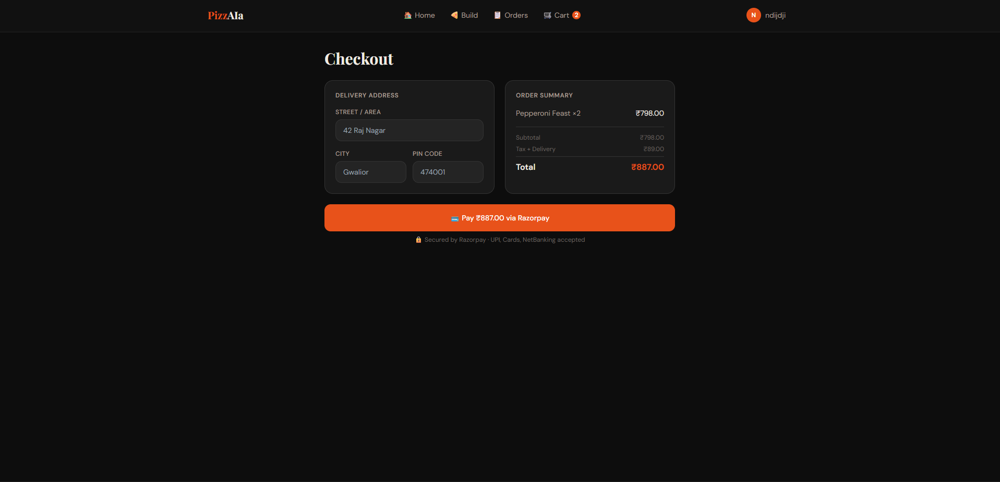
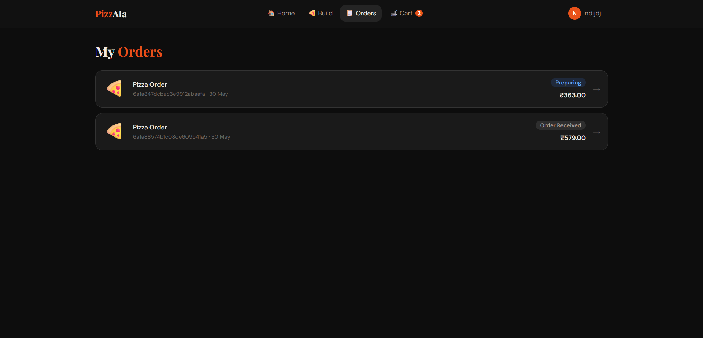
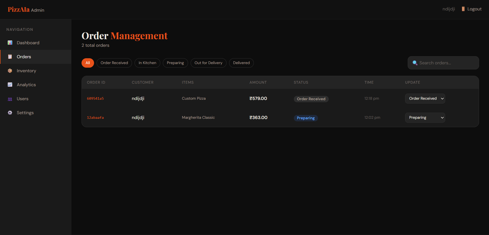
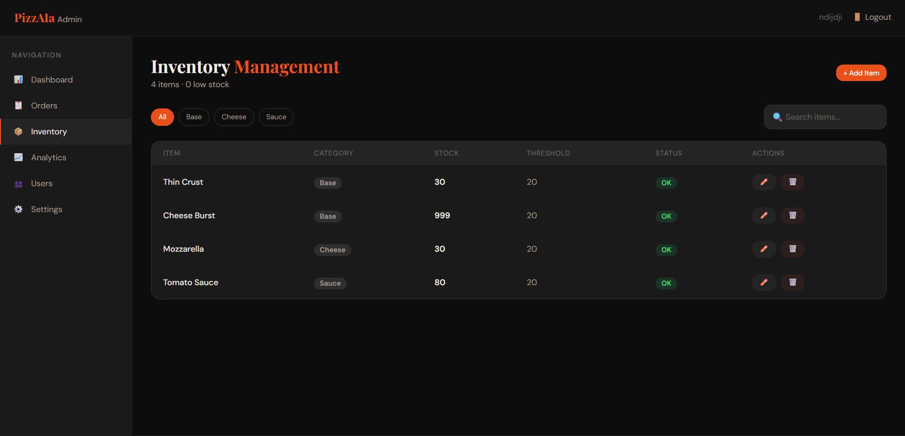
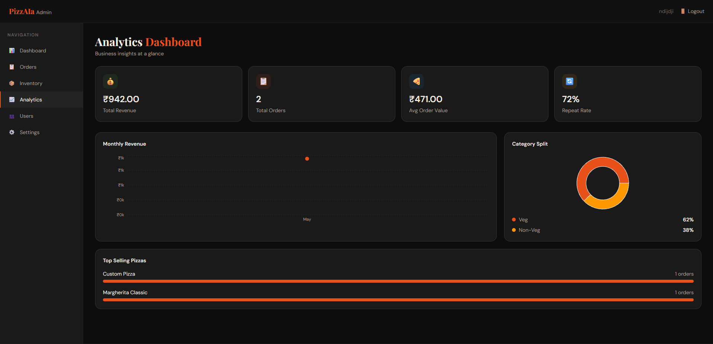

# 🍕 PizzAIa — Full Stack Pizza Ordering Platform

<p align="center">
  
  
  
  
</p>

A modern full-stack pizza ordering platform built with the MERN stack. Users can browse pizzas, build custom pizzas, place orders using Razorpay, and track deliveries in real time. Administrators can manage inventory, orders, users, and business analytics through a dedicated admin dashboard.

PizzAIa is a MERN Stack web application that enables customers to order pizzas online, customize their own pizzas, make secure payments through Razorpay, and track orders in real time. The platform also provides administrators with inventory management, order monitoring, low-stock alerts, and business analytics.

---

# ✨ Features

## 👤 User Features

- Secure Registration & Login
- Email Verification
- JWT Authentication
- Pizza Catalog
- Search & Filter Pizzas
- Custom Pizza Builder
- Shopping Cart
- Coupon System
- Razorpay Payment Integration
- Order History
- Real-Time Order Tracking
- User Profile Management
-  Forgot Password & Password Reset

## 👨‍💼 Admin Features

- Admin Dashboard
- Order Management
- Live Status Updates
- Inventory Management
- Low Stock Alerts via Email
- User Management
- Revenue Analytics
- Top Selling Pizza Insights

---

# 🛠️ Tech Stack

### Frontend

- React.js
- Redux Toolkit
- React Router
- Tailwind CSS
- Axios
- Recharts
- Socket.IO Client

### Backend

- Node.js
- Express.js
- MongoDB
- Mongoose
- JWT
- Socket.IO
- Nodemailer

### Payment Gateway

- Razorpay

---

# 📸 screenshot

## 📷 Home Page



---

## 📷 Custom Pizza Builder



---

## 📷 Shopping Cart



---

## 📷 Checkout Page



---

## 📷 My Orders



---

## 📷 Real-Time Order Tracking


---

## 📷 Admin Order Management



---

## 📷 Inventory Management Dashboard



---

## 📷 Analytics Dashboard



---

# 🚀 Installation

## Clone Repository

```bash
git clone https://github.com/universecoder1008/OIBSIP.git
cd OIBSIP
```

## Install Dependencies

### Backend

```bash
cd backend
npm install
```

### Frontend

```bash
cd ../frontend
npm install
```

### Root Project

```bash
cd ..
npm install
```

## Configure Environment Variables

Create a `.env` file inside the `backend` directory:

```env
PORT=5000

MONGO_URI=your_mongodb_connection_string

JWT_SECRET=your_jwt_secret

RAZORPAY_KEY_ID=your_razorpay_key_id
RAZORPAY_KEY_SECRET=your_razorpay_key_secret

EMAIL_USER=your_email
EMAIL_PASS=your_email_password
```

## Run Application

```bash
npm run dev
```

## Application URLs

Frontend:

```text
http://localhost:5173
```

Backend:

```text
http://localhost:5000
```


---


# 📁 Project Structure

```text
backend/
│
├── src/
│   ├── config/
│   ├── controller/
│   ├── middleware/
│   ├── models/
│   ├── routes/
│   └── utils/
│
└── server.js

frontend/
│
├── src/
│   ├── components/
│   ├── features/
│   ├── hooks/
│   ├── pages/
│   ├── services/
│   ├── utils/
│   └── store.js
```

---

# 🌟 Project Highlights

✅ Real-Time Order Tracking using Socket.IO

✅ Razorpay Payment Integration

✅ Custom Pizza Builder

✅ Inventory Management System

✅ Automated Low Stock Email Alerts

✅ Analytics Dashboard

✅ Responsive Modern UI

---

# 🔮 Future Enhancements

- Delivery Partner Dashboard
- Push Notifications
- Ratings & Reviews
- Google Maps Integration
- AI Pizza Recommendations
- Advanced Sales Analytics

---

# 👨‍💻 Author

**Nikhil Thakur**

B.Tech Electronics Engineering  
MITS Gwalior

GitHub: https://github.com/universecoder1008
Project Repository: https://github.com/universecoder1008/OIBSIP

---

<p align="center">
⭐ If you like this project, consider giving it a Star on GitHub!
</p>
